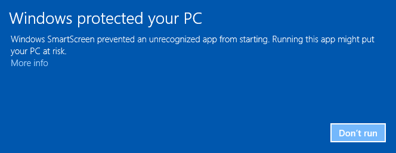

# go-dbg

## Installing Git on Windows

Unfortunately, Microsoft *might* block the installation of Git. This is due to missing certificates, as most open source
projects do not have the resources to buy such an certificate from Microsoft. If you see an error like this one



there is no need to worry. Git has been around for years and is used by hundreds of thousands of developers every day
and is completely open source and peer reviewed. To override the faulty Windows SmartScreen, click on **More info**


and press **Run anyway**. Now, the installer should start.


There is no need for customization while installing and you can simply use the default settings
by pressing **Next >**. When the installer is done, you should see this:


## Installing Git on OSX

Once you have downloaded the git installer, open the file with right-click -> open and confirm
the following dialogue:


Everything else should work per default and you should end up with this screen:


## Installing Git on Linux / Debian-ish

```
sudo apt-get install git
```

## Install Go

Download and install the right package for your system from
[golang.org/dl](https://golang.org/dl).

### Setting up Go on Linux / OSX (macOS)

Open the OSX Terminal:


And enter the following lines one-by-one (except the ones beginning with #). You can use copy & paste!

```
# Create a workspace directory
mkdir -p ~/workspace/go

# Tell go where your workspace is
echo "GOPATH=~/workspace/go" >> ~/.bash_profile

# Add binaries created by go to your PATH
echo "PATH=~/workspace/go/bin:$PATH" >> ~/.bash_profile

# Skip rebooting ;)
source ~/.bash_profile

# This should work now
go help
```

### Setting up Go on Windows

Open the start menu, type `cmd.exe` and right click on **Open as administrator**

```
setx /M PATH "%PATH%;C:\Users\Aeneas\workspace\go\bin"
setx /M GOPATH "C:\Users\Aeneas\workspace\go"
```

Now, close and reopen cmd.exe and confirm the go works:

```
go help
```

